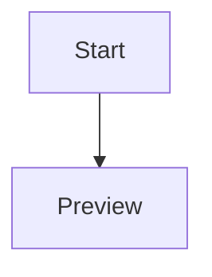

# StackEdit print proof

This source document seeds the shared Stage 0 editor shell with inline math $E = mc^2$.

| Gate | Status |
| --- | --- |
| KaTeX | proved |

$$
\frac{a}{b}
$$

```mermaid
flowchart TD
  Start --> Preview
```
