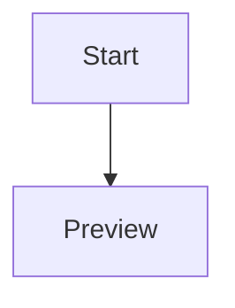

# StackMark print proof

This source document seeds the shared Stage 0 editor shell with inline math $E = mc^2$.

The print proof deliberately repeats ordinary editorial prose so the browser must create multiple A4 pages. A calm, readable page should keep paragraphs together where possible while allowing long technical documents to flow naturally across page boundaries. This sentence is representative of the Markdown content a StackMark author can review before opening the print dialog.

Documentation is rarely a single screen. It carries decisions, examples, tables, equations, and diagrams that need to remain legible when read on paper. The proof keeps its source simple and relies on the existing Markdown sanitizer, KaTeX renderer, and isolated Mermaid renderer before anything reaches the print-only document.

When a page is nearly full, a heading should travel with the content that follows it. Images and diagrams should scale down rather than escape the printable area, while code remains available through safe line wrapping. These are ordinary rules, but the browser proof makes them observable instead of trusting an untested stylesheet.

| Gate | Status |
| --- | --- |
| KaTeX | proved |
| Paged.js | bounded fallback |
| Mermaid | static sanitized SVG |

## Readable technical content

The same policy applies to long-form notes. Each paragraph below adds enough measured content for the A4 pagination engine to produce a second page without inventing print-only HTML or accessing a desktop capability. The output is deliberately plain, which makes it useful as a feasibility proof rather than a final publishing template.

An author might describe an experiment, explain its constraints, and include a table of findings. A reviewer can then print the record to PDF and check its layout at a different screen size. The print view needs only static sanitized output; rendering code and file adapters stay outside this narrow document boundary.

Reliable fallback behavior matters as much as the happy path. If a pagination library times out, the document remains printable with ordinary CSS. A visible warning gives the reviewer context while avoiding a dialog that waits forever for a library that has stopped responding.

This paragraph supplies further continuous prose for the page-flow check. It uses no remote asset, no executable markup, and no special browser privilege. The local application bundle contains the fonts required by the mathematical expression below, so a disconnected review remains representative of the desktop target.

$$
\frac{a}{b}
$$

```ts
interface PrintResult {
  mode: 'pagedjs' | 'plain-css'
  pageCount: number
  warnings: Array<{ code: string; message: string }>
}

const result: PrintResult = {
  mode: 'pagedjs',
  pageCount: 2,
  warnings: [],
}
```

## Diagram handoff

The diagram below is rendered in the opaque Mermaid iframe and then passed only as separately sanitized static SVG. Pagination sees the inert result, not Mermaid source code, a renderer frame, or a capability adapter.


